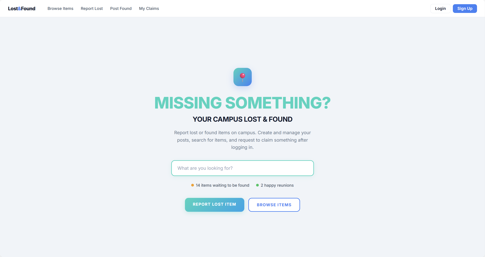

# CS5610 Project2 - Lost & Found Tracker

## Author
- Jikuan Wang
- Soni Rusagara

## Class Link
https://northeastern.instructure.com/courses/245751

## Project Objective
Build a campus Lost & Found web app where users can sign up/login and post lost or found items. Users can edit or delete their posts and use basic search/filter to find items. The app uses Node, Express, vanilla ES6 (client-side rendering), and MongoDB (Node driver), with basic accessibility support.

## Screenshot


## Instructions to build

### 1 Install
```bash
npm install
```

### 2 Set MongoDB connection
```bash
export MONGO_URL="YOUR_MONGO_CONNECTION_STRING"
export DB_NAME="project2_lost_and_found"
```

### 3 Start server
```bash
node server.js
```

### 4 Open pages in browser
http://localhost:3000/login.html
