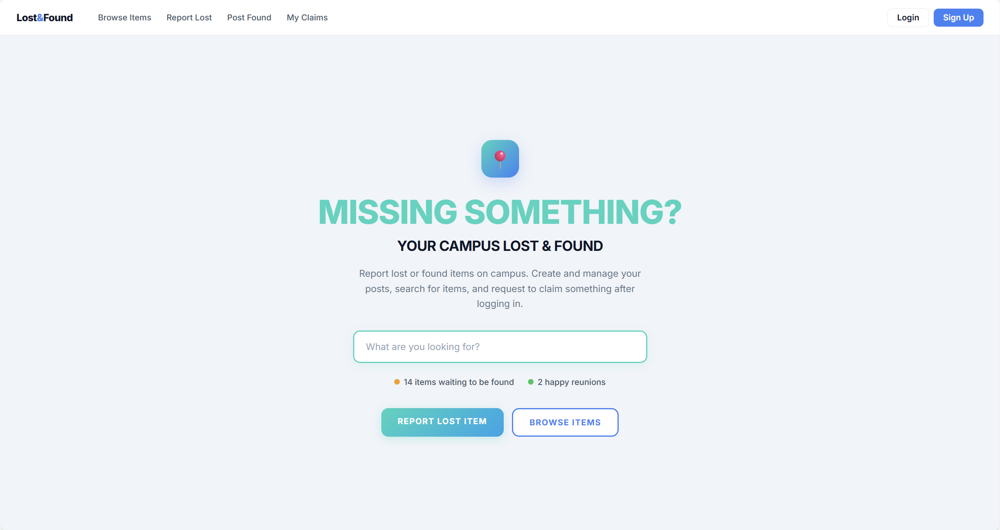

# CS5610 Project2 - Lost & Found Tracker

## Author

- Jikuan Wang
- Soni Rusagara

## Class Link

https://northeastern.instructure.com/courses/245751

## Project Objective

Build a campus Lost & Found web app where users can sign up/login and post lost or found items. Users can edit or delete their posts and use basic search/filter to find items. The app uses Node, Express, vanilla ES6 (client-side rendering), and MongoDB (Node driver), with basic accessibility support.

## Screenshot



## Design Document

[View the design document](./design.md)

## Live Application

Deployed on Render:

https://lost-and-found-tracker-c0kf.onrender.com

## Instructions to build

### 1. Install

```bash
npm install
```

### 2. Set MongoDB connection

macOS / Linux:

```bash
export MONGO_URL="YOUR_MONGO_CONNECTION_STRING"
export DB_NAME="project2_lost_and_found"
```

Windows (PowerShell):

```powershell
$env:MONGO_URL="YOUR_MONGO_CONNECTION_STRING"
$env:DB_NAME="project2_lost_and_found"
```

### 3. Start server

```bash
node server.js
```

### 4. Open pages in browser

http://localhost:3000

### Generate Sample Data

```bash
node seed.js
```

## Peer Review by Ruotian Zhang

The project is very complete and runs smoothly. The data collection is accurate and well implemented.

One minor improvement could be the user experience when reporting an item without being logged in. Currently, after being prompted to log in, the form progress is lost. It might be helpful to provide a reminder beforehand or preserve the entered information to improve usability.

Overall, this is a very thorough and excellent submission！
