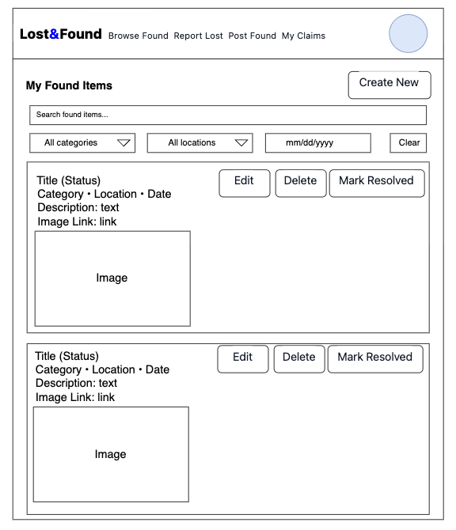
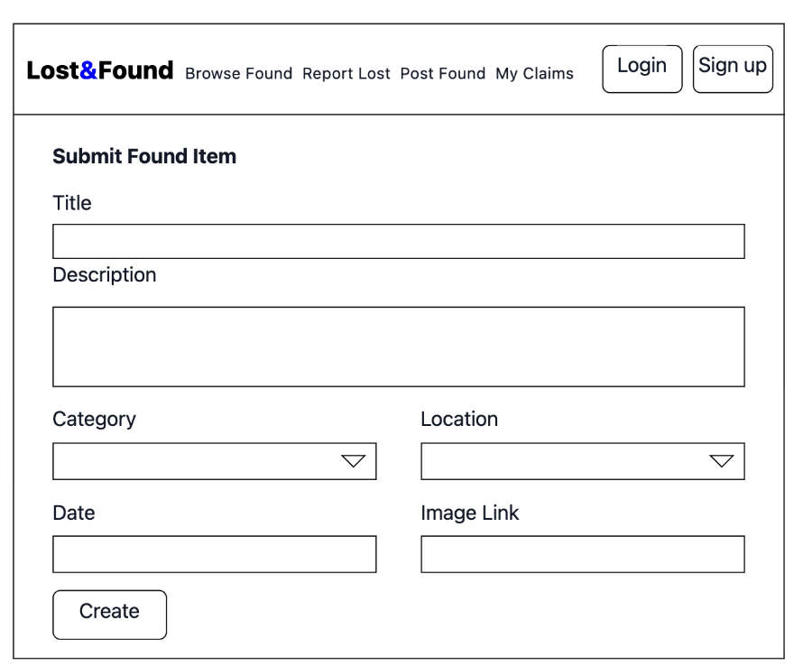
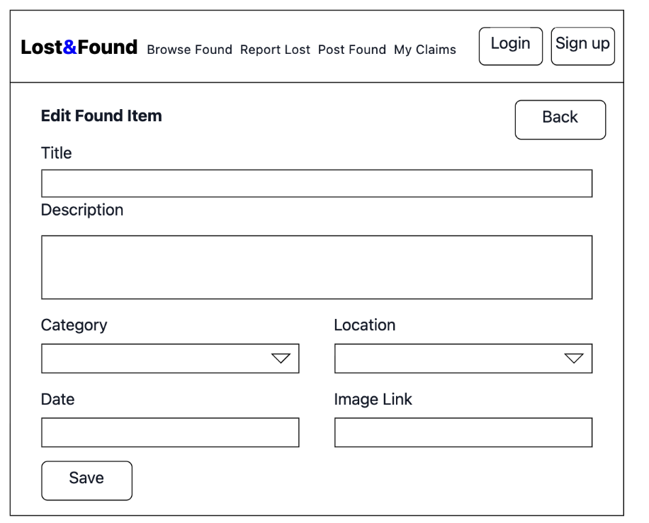
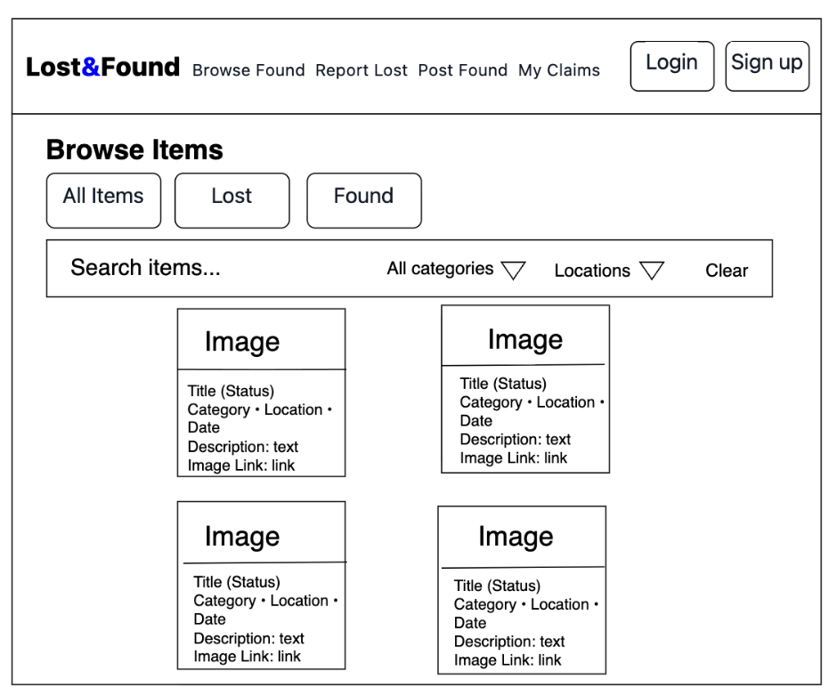
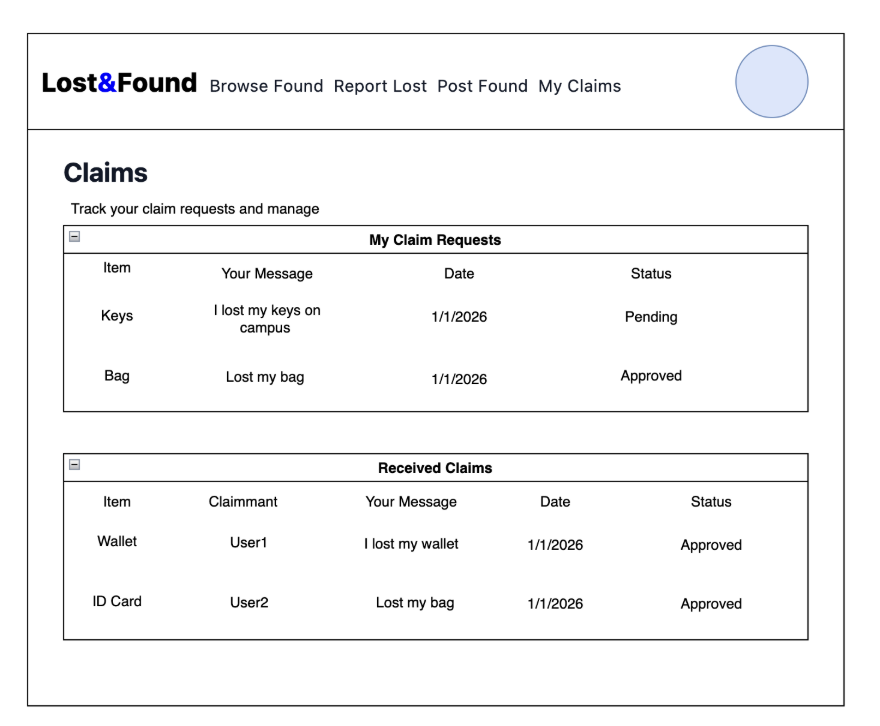
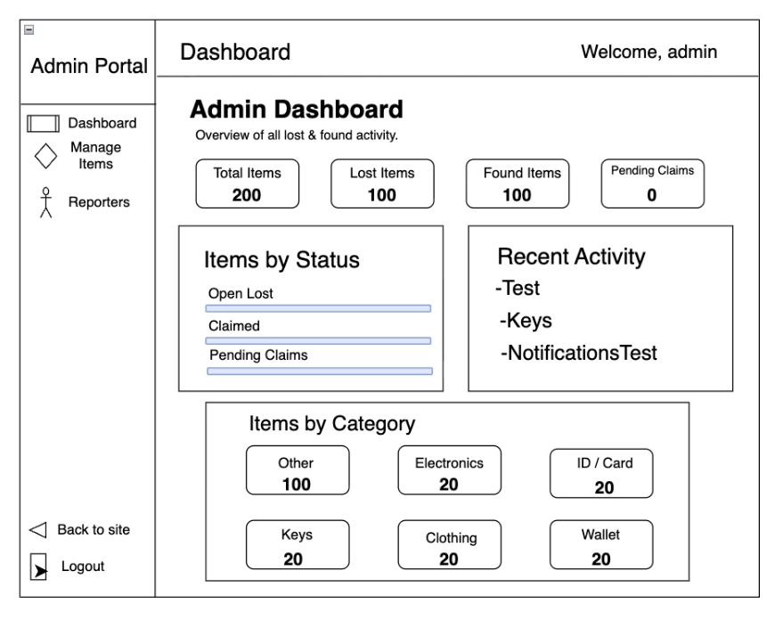

# Project Description

Lost & Found Tracker is a web app for reporting and finding lost items on campus. Users can submit lost or found items with details like name, description, location, and date. They can search or filter items and get notifications when a match is found. The system will include accessibility features for users with disabilities.

# User Personas

## User Persona 1

**Name:** Emma  
**Age:** 20  
**Role:** College Student

### Scenario

Emma is always busy with classes and activities. She sometimes loses small things like her keys, headphones, or student ID on campus. She wants a fast way to report what she lost and check if someone found it.

### Goals

- Report a lost item quickly
- Find out if someone posted a matching found item
- Get her item back as soon as possible

### Needs

- A simple form to create a lost-item post
- Search and filters to browse posts

### Pain Points

- Losing time walking around campus asking people
- Too many posts to scroll without filters
- Not knowing if someone found the item

## User Persona 2

**Name:** John  
**Age:** 35  
**Role:** Campus Staff

### Scenario

John works on campus and often finds lost items in classrooms or public areas. He wants an easy way to log found items so students can claim them.

### Goals

- Post found items fast with location and date
- Help students get their items back safely
- Reduce repeated questions about lost items

### Needs

- A simple form to submit found-item posts
- A clear way to mark an item as returned
- Basic rules to prevent wrong claims

### Pain Points

- Keeping track of many found items manually
- Students asking about items without details
- People claiming items that are not theirs

## User Persona 3

**Name:** Sophie  
**Age:** 22  
**Role:** Student with Visual Impairment

### Scenario

Sophie has visual impairment and may not notice small changes on a page. When she uses the app, she needs very clear feedback after every action. She wants to clearly know if something was successful or if it failed.

### Goals

- Report a lost item by herself
- Understand clearly if her action was successful or not
- Feel confident that the system is responding correctly

### Needs

- Clear and simple page layout
- Different color alerts for success and error
- Different sound alerts for success and failure so she can easily tell the difference

### Pain Points

- Not knowing whether a form submission worked
- Error messages that are hard to see
- Alerts that look similar and are hard to distinguish

# User Stories

## Jikuan

- As a user, I want to register, log in, and log out so that I can access my account securely.
- As a user, I want to create a lost-item post with basic details (title, description, category, location, date, optional image) so that others can help me find my item.
- As a user, I want to view, edit, delete, and mark my lost-item posts as resolved so that my information stays correct.

## Soni

- As a user, I want to create a found-item post and search or filter lost items so that I can find a possible match.
- As a user, I want to send a claim request for an item and have the owner approve or reject it so that the item can be returned safely.
- As an admin, I want to review and remove suspicious posts so that the system stays reliable and safe.

# Design Mockups

## Welcome page

## Register page

## Login page

## Create lost item page

## Edit lost item page

## My lost items page

## My found items page

## Create found item page

## Edit found item page

## Browse items page

## Claims page

## Admin page

