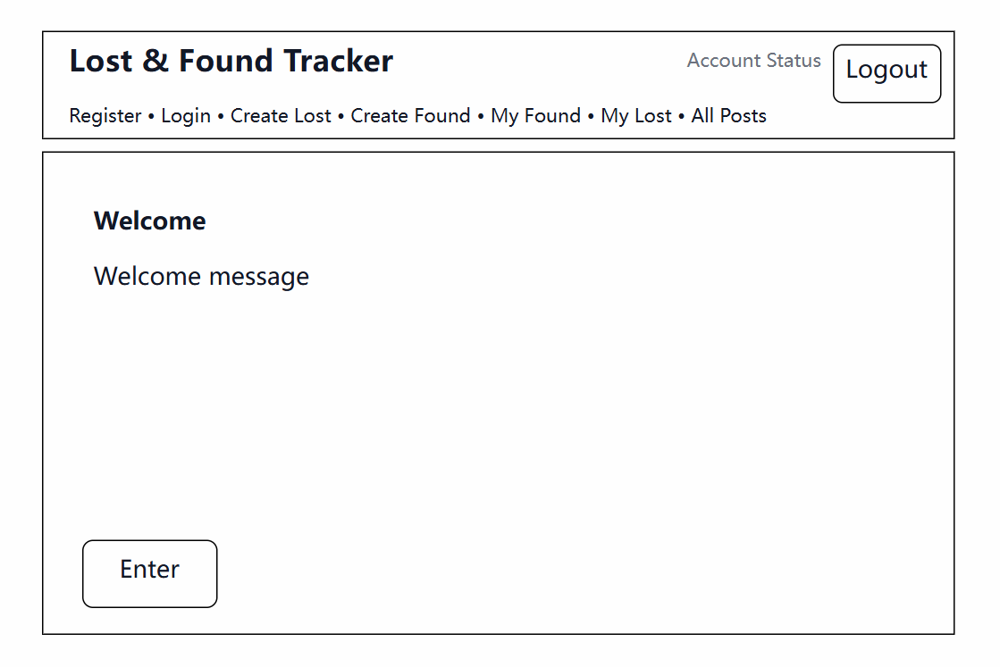
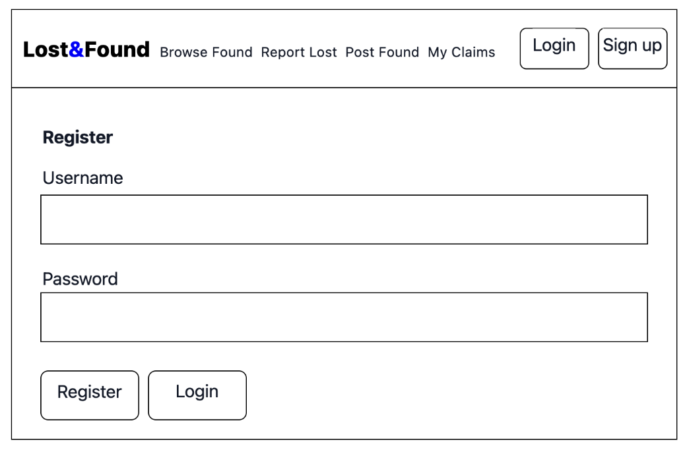
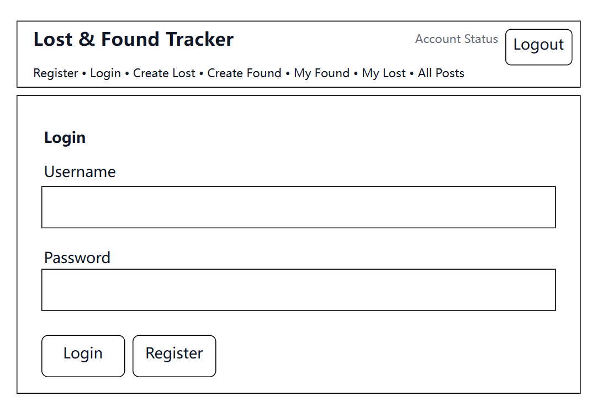
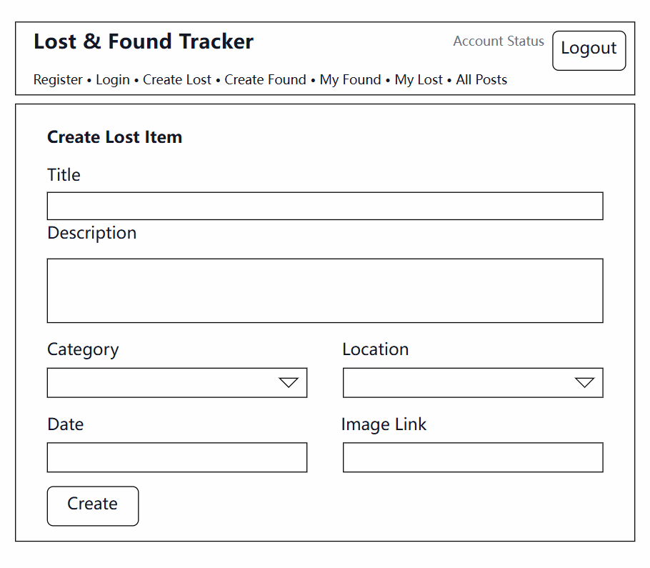
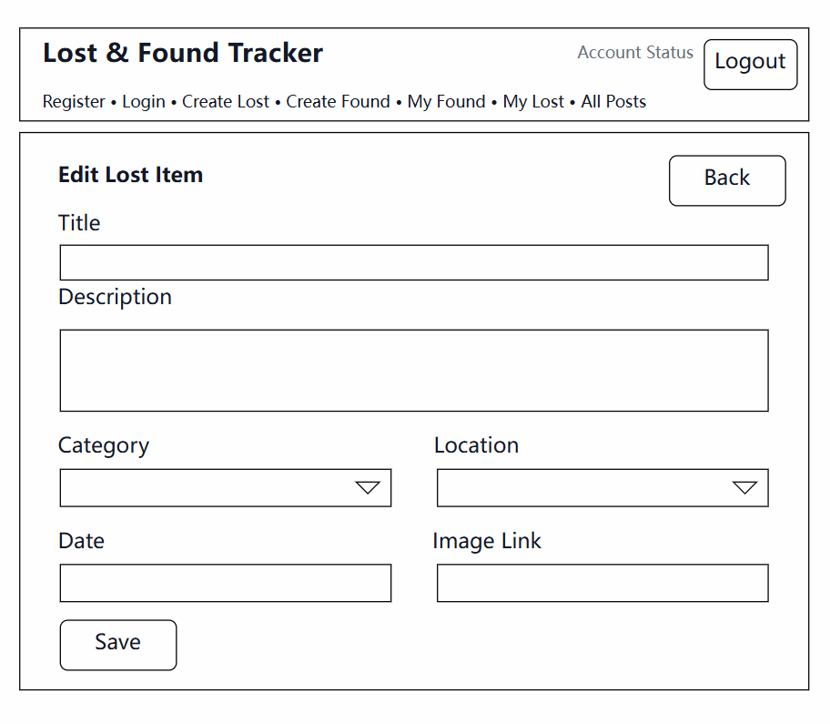
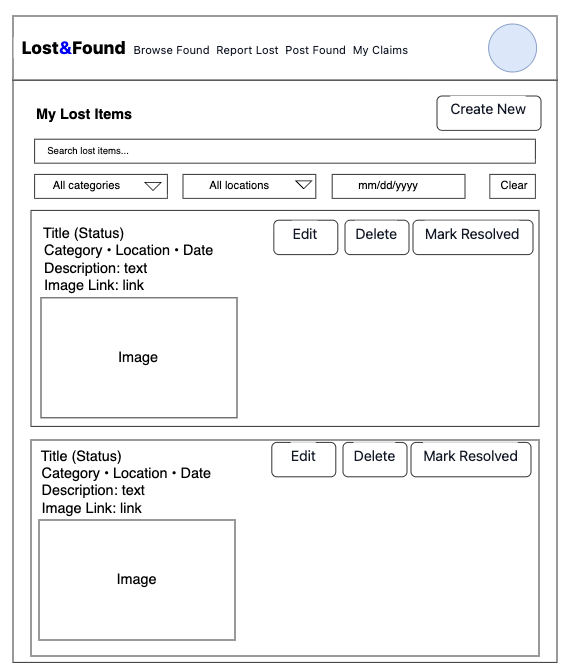

## Project Description:

Lost & Found Tracker is a web app for reporting and finding lost items on campus. Users can submit lost or found items with details like name, description, location, and date. They can search or filter items and get notifications when a match is found. The system will include accessibility features for users with disabilities.

## User Personas:

1. College Student (Emma)  
   Emma is a busy college student who sometimes loses small items like keys, headphones, or her ID card. She wants a quick and easy way to report lost items and check if someone has found them.
2. Campus Staff (John)
   John works on campus and often finds lost items in classrooms or public areas. He wants a simple way to log found items so students can get their belongings back.
3. Student with Visual Impairment (Sophie)
   Sophie is a student with visual impairment. She needs clear and accessible pages, including screen-reader-friendly design and easy-to-notice alerts, so she can know when her lost item has been found.

## User Stories:

### Jikuan

- As a user, I want to register, log in, and log out so that I can access my account securely.
- As a user, I want to create a lost-item post with basic details (title, description, category, location, date, optional image) so that others can help me find my item.
- As a user, I want to view, edit, delete, and mark my lost-item posts as resolved so that my information stays correct.

### Soni

- As a user, I want to create a found-item post and search or filter lost items so that I can find a possible match.
- As a user, I want to send a claim request for an item and have the owner approve or reject it so that the item can be returned safely.
- As an admin, I want to review and remove suspicious posts so that the system stays reliable and safe.

## Design Mockups:

### Welcome page

### Register page

### Login page

### Create lost item page

### Edit lost item page

### My lost items page

